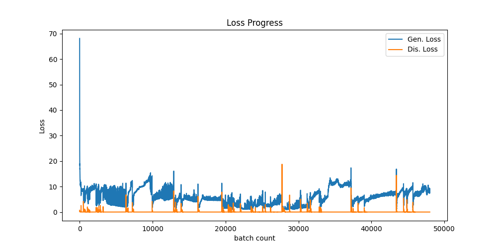

<h2>
DOF lab & INU 합작 프로젝트 수업
</h2>
<h3>
DOF lab에서 제공한 구강 데이터를
<h5>(finger, opposing, gap data 등)</h5> 
활용한 p2p 모델 
target의 양옆 치아와 반대쪽 치아 데이터를 활용해 target을 복원
</h3>
<h3>
RESULT
</h3>
<h4>
best case
원본 데이터

epoch 500 결과

epoch 3000 결과

learning curve

p2p 모델의 논문에서는 rgb 이미지(채널이 3인 데이터)를 사용했으므로 
gap, opposing, input image 만 사용하였으나, 

개선이 되었다고 생각하진 않음
</h4>